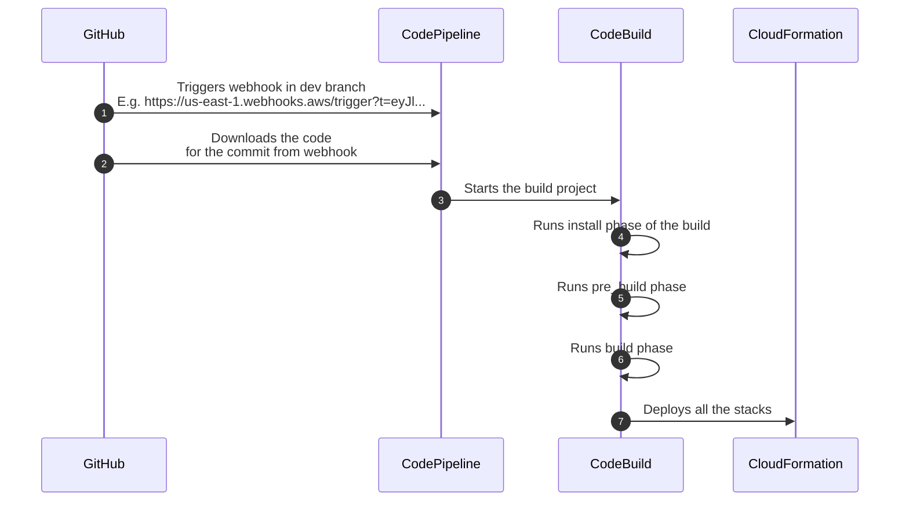
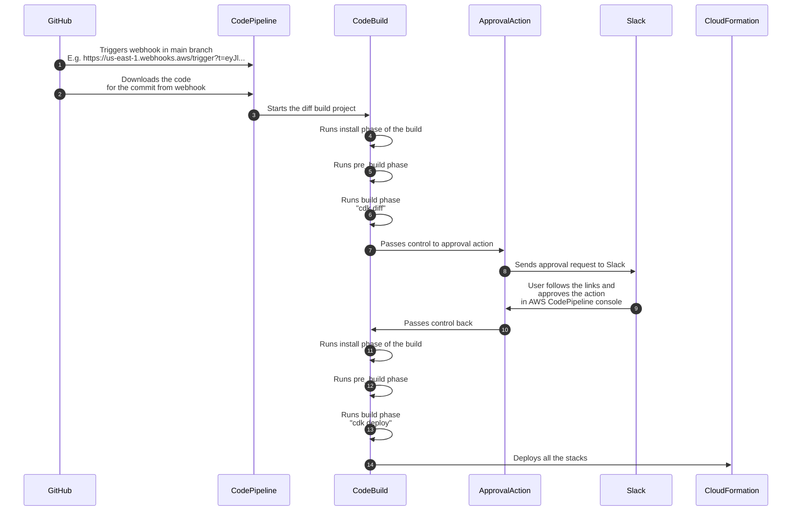

# Deploy CDK App With Approval
The construct creates `CodePipeline` which synths and deploys CDK app. Optinally the pipeline may require approval (sent to Slack) before the final deployment of the app.

## Staging deployment
The diagram below shows how can the construct be used for deploying a staging stage, which does not require an approval from trh team.

## Production deployment
Production deployment, in comparison to staging deployment, adds two more steps:
* `cdk diff` with output, to review upcoming changes
* And `ApprovalAction` to approve or reject changes announced by `cdk diff`.

> ⚠️ The diagram exposes some redundancy presented in the process (diff and deploy phases are almost the same). It's a subject for future improvements.

## Notes
* `CodePipeline` does not provide a way to define how it reacts to certain webhook events.

  It is triggered by any webhook in the specified branch.

* Each instance of the `CodePipeline` (one per account) sets its own GitHub webhook on GitHub side.

  Events which are sent to AWS webhook endpoint must be configured in GitHub settings. Basically these events are different for each webhook endpoint. E.g. staging account webhook endpoint should receive dev branch push events. While production account webhook endpoint must receive a published release events.
